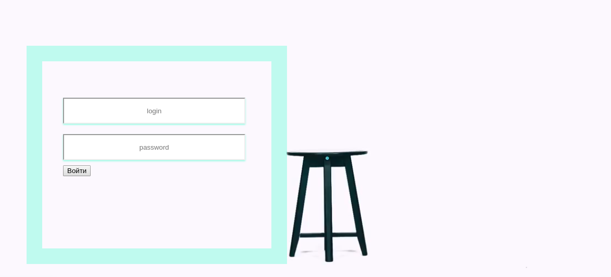

# <h2> FaceHack-js </h2>

Little performance in web.  Made for fun  :) 

  

Author: Maxim Gylenko 

<h2> How to start </h2>
<ol>
<li> Clone this repository </li>
<li> npm install</li>
<li> npm start </li>
<li> Create your account </li>
<li> Give access to your the webcam </li>
<li> Let's joke with your paranoid friends =) </li>
<ol>

<h2> Technologies </h2>

<ul>
<li> Express js </li>
<li> OpenCV js</li>
<li> MongoDB </li>
<li> Canvas </li>
<li> Handelbars </li>
<ul>

  

  

Wish you nice day!

